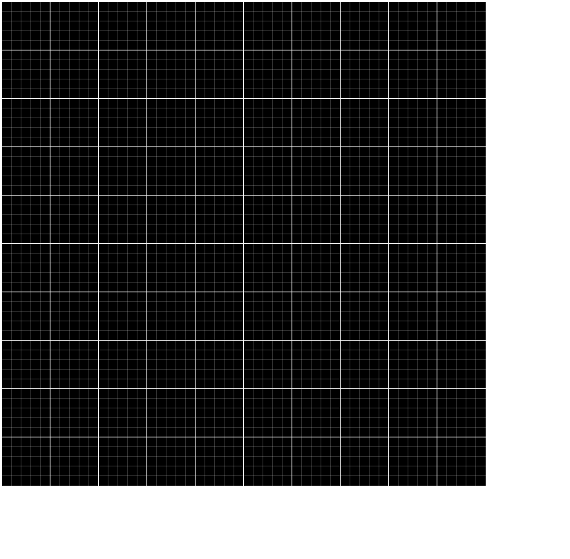
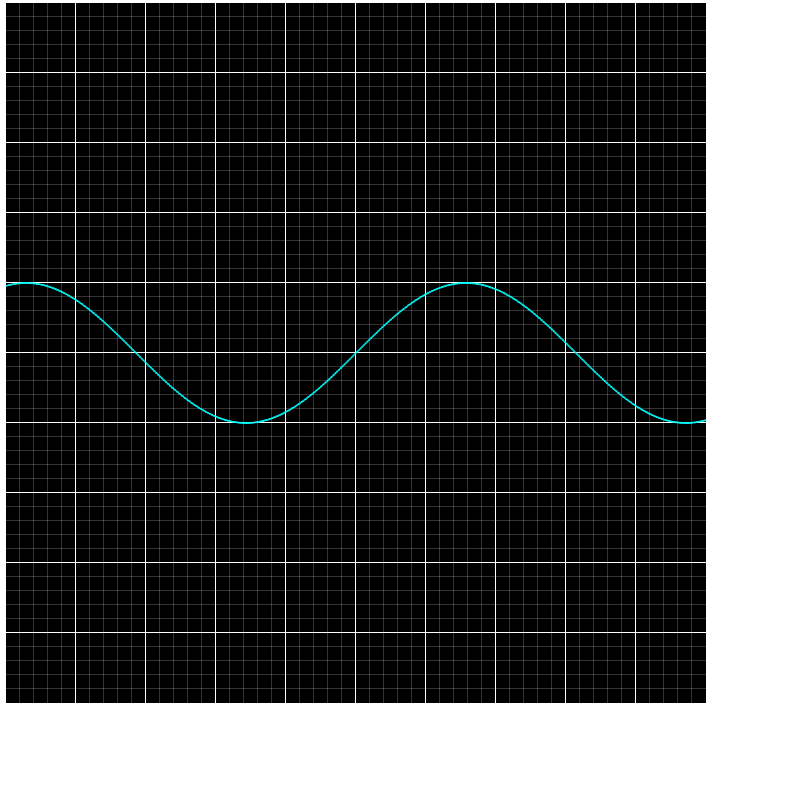
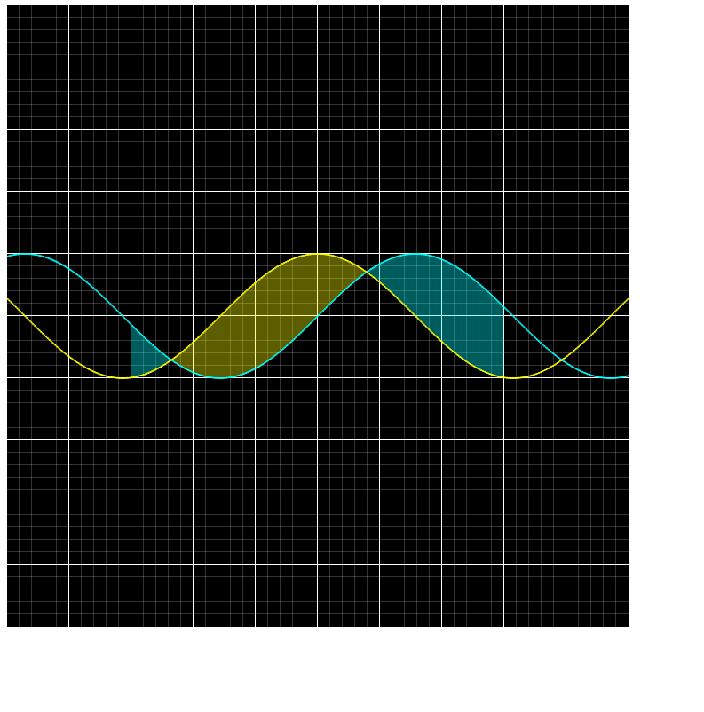
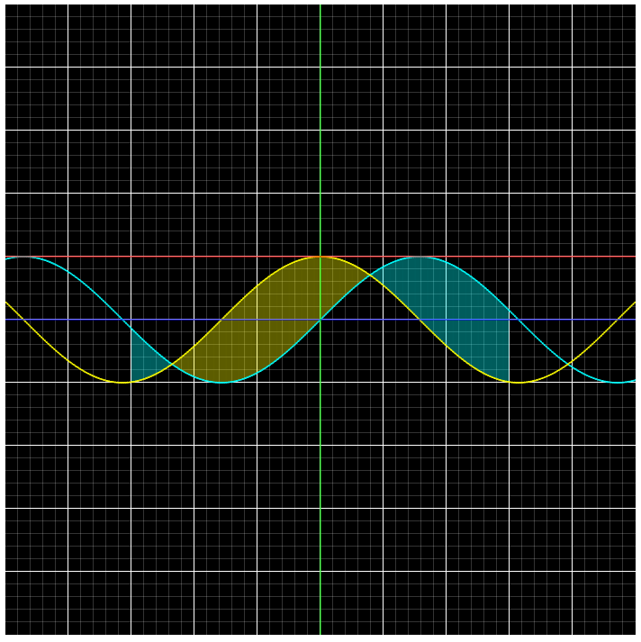
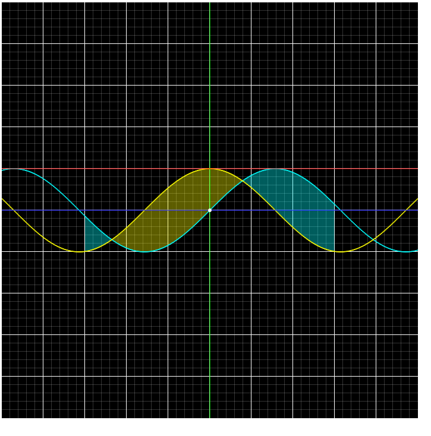
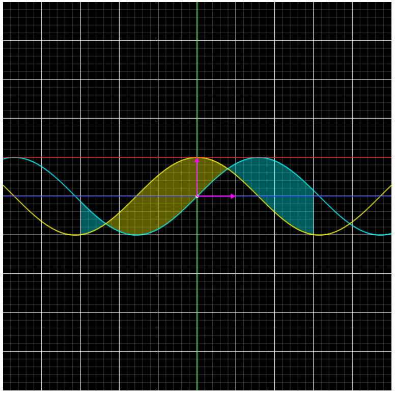
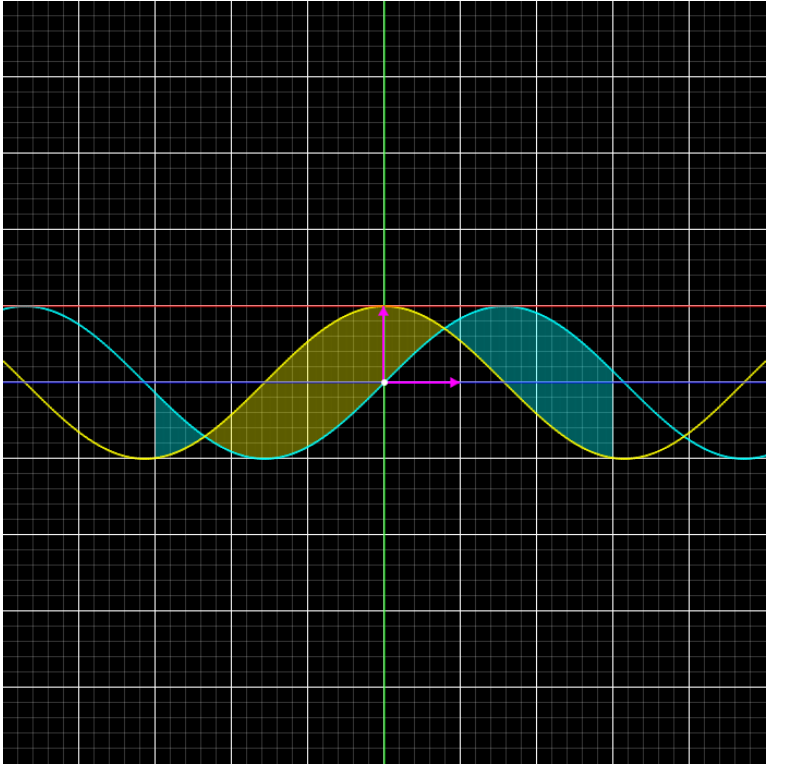
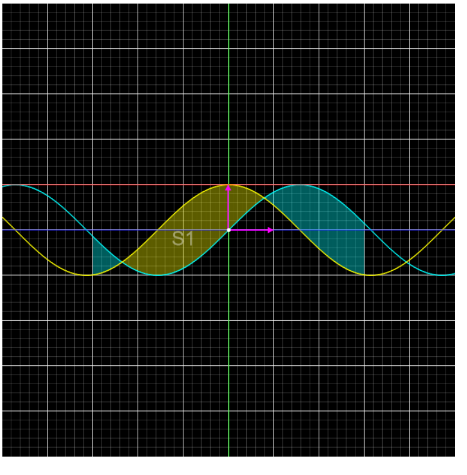

# MathA

## Here is a quick documentation:

#

# Import Library
    first you have to download the mathA.graphs.js file in the project folder

    then import the Graphs object by using :

```javascript
    import Graphs from "./mathA.graphs.js";
```

    the Graphs object contains 8 element classes

    - background
    - axes map
    - graphs
    - integration
    - line
    - point
    - vector
    - name

### 1 - background :
    
    background is the place where you will render all the elements such as (graphs, vectors ...)
    background takes 3 parameters [height, width, color]
        width : control the width of the background {default : 1280}
        height : control the height of the background {default : 720}
        color : control the color of the background {default : #000000}

```javascript
    const background = new Graphs.Background({
        height: 700,
        width: 700,
        color: "#000000",
    });
```

    now to render our background we need to call the renderIn method from background variable

    the method take an html element as a parameter to render the background inside of it

    if no element is giving to the method it will automaticly search for an element with id='root' to render the content in it

```javascript
    background.renderIn();
```


### 2 - axes map :

    the axes map is the most important element because it contains the origin and size which all the other elements depend on to render the content correctly 
    the axes map takes 8 parameters [x_units, y_units, x_sub_units, y_sub_units, origin, line_width, sub_line_width, color]
        x_units : number of horizontal units {default : 4}
        y_units : number of vertical units {default : 4}
        x_sub_units : number of horizontal sub units in each unit {default : 5}
        y_sub_units : number of vertical sub units in each unit {default : 5}
        line_width : the width of the lines which make the x and y units {default : 1}
        sub_line_width : the width of the lines which make the x and y sub units
        {default : 0.2}
        origin : the zero point which every thing related to { default : [2,2] }
        color : color of lines and sub lines {default : #ffffff}
    dont forget to use the background as a second argument so the axes map can render in side of it
    notice that when you leave a parameter without assign a value to it it will automaticlly take its default value 

```javascript
    const axes_map = new Graphs.AxesMap(
        {
            x_units: 10,
            y_units: 10,
            origin: [5, 5],
        },
        background
        );
    axes_map.render();
```
    notice that I have put the origin in the coordinates x = 5 and y = 5 so it become in the center of the axes map because we have 10 x and y units



### 3 - graph : 

    to draw a graph we use the graph class which take 5 parameters and the axes map as a second argument
    parameters : [expression, domains, color, line_width, step]
    expression : the function you want to sketch { default (x) => x }
    domains : an array of contain the start and the end of each domain you want to graph the function at { default : [[2,2]] }
    step : control the precision of the graph {default 0.01}
    note : the close the step to zero the better the graph but using very small number may cause some glitches in the graph
    rest are clear

```javascript
    const sin = new Graphs.Graph(
        {
            domains: [[-5, 5]],
            expression: (x) => Math.sin(x),
            color: "#00ffff",
        },
        axes_map
    );
    sin.render();
```

    notice that we used one domain from -5 to 5 and thats because we want to draw the sin function in all of the axes map because we have use 10 x_units and we put our origin in the 5th



### 4 - integration :

    integratrion is easy to use because it take 2 parameters and the two functions you want to integrate
    parameters : [domain, step] they are the same as in the graph class but unlike the graph the integral takes only one domain;

```javascript
    const cos = new Graphs.Graph(
    {
        domains: [[-5, 5]],
        expression: (x) => Math.cos(x),
        color: "#ffff00",
    },
    axes_map
    );
    cos.render();

    const integral = new Graphs.Integral(
    {
        domain: [-3, 3],
    },
    sin,
    cos
    );
    integral.render();
```

    here we have added cos graph to the previous one and we integrate the from -3 to 3
    notice that the integration gets the color of the heigher graph



### 5 - line :

    line takes 5 parameters and the axes map to be drawn
    parameters : [a, b, domain, line_width, color]
    the line is a graph with only one step which is as big as the domain and one and only one expression avaible by default which is a * x + b

```javascript
    const x_axis = new Graphs.Line(
    {
        domain: [-5, 5],
        a: 0,
        b: 0,
        color: "#0000ff",
    },
    axes_map
    );
    x_axis.render();

    const y_axis = new Graphs.Line(
    {
        domain: [-0.01, 0.01],
        a: 99999,
        b: 0,
        color: "#00ff00",
    },
    axes_map
    );
    y_axis.render();

    const line = new Graphs.Line(
    {
        domain: [-5, 5],
        a: 0,
        b: 1,
        color: "#ff0000",
    },
    axes_map
    );
    line.render();
```
    here we have sketched 3 different lines x_axis with blue y_axis with green and a random line (x) => 1 with red

    notice that we dont have a vertical line class yet in the library so i am going to use a huge a (99999) in very small domain to draw a vertical line



### 6 - point :
    the point takes 3 parameter [radius, position[x, y], color]

```javascript
const origin = new Graphs.Point(
  {
    radius: 3,
    position: [0, 0],
    color: "#ffffff",
  },
  axes_map
);
origin.render();
```



### 7 - vector :
    vectors take 4 parameters [line_width, color, head_size, from_to]
        head_size : controle the size of the arrow head
        from_to : [x1, y1, x2, y2] controle from the vector start and where it ends

```javascript
    const x_unit_vector = new Graphs.Vector(
    {
        color: "#ff00ff",
        from_to: [0, 0, 1, 0],
        head_size: 10,
    },
    axes_map
    );
    x_unit_vector.render();

    const y_unit_vector = new Graphs.Vector(
    {
        color: "#ff00ff",
        from_to: [0, 0, 0, 1],
        head_size: 10,
    },
    axes_map
    );
    y_unit_vector.render();

```



    now we have created 2 maginta vectors shows the x and y unit
    notice that the vectors are above the origin point which makes it look bad thats because of the layer system which is use in the library vectors layer is 7 which is heigher that point layer which is 6 to fix that we need to change the z-index in the point canvas and to do that we need to get its html element and change the styles

```javascript
    origin.html.style.zIndex = `8`;
```



### 8 - name :
    name is an element use to print texts which is supose to be the names of the elements
    names take 4 parameters [font_size, color, text, position]
    text : the name of the element
    notice that you can name all the elements but (background, axes map, and another name) which is use as a second argument and the axes map as the third

```javascript
    const s1 = new Graphs.Name(
    {
        position: [-1, -0.2],
        font_size: 30,
        color: "#ffffff",
        text: "S1",
    },
    integral,
    axes_map
    );
```
    notice that the names dont need any render method they are automaticlly rendered and deleted with there element



## and thats it

#

# conclusion 
    I hope that you like the library if you did please support us with a star an help us to improve this open source project ^^

